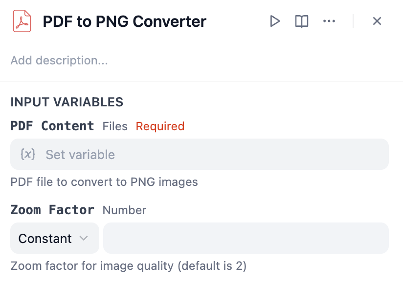

# PDF Process Plugin for Dify

A comprehensive suite of PDF processing tools for Dify, enabling various PDF operations like page extraction, counting, and splitting.

## Overview

PDF Process is a collection of powerful tools designed to perform various PDF operations within the Dify environment. Each tool is specialized for specific PDF manipulation tasks, making it easy to integrate PDF processing capabilities into your workflows.

## Features

- Single page extraction
- Multiple pages extraction with fixed page support
- PDF page counting with customizable output formats
- PDF splitting into individual pages
- PDF to PNG conversion with adjustable quality

## Important Note
All page numbers in this plugin are 1-indexed, meaning the first page of any PDF is page 1, the second is page 2, and so on.

## Available Tools

### 1. PDF Single Page Extractor
Extracts a specific page from a PDF file and saves it as a new PDF.

Parameters:
- **PDF Content**: The input PDF file (required)
- **Page Number**: The specific page to extract (1-indexed, where page 1 is the first page, required)

### 2. PDF Multi Pages Extractor
Extracts specified pages from a PDF file. Supports flexible page specifications like ranges ("1-3"), individual pages ("1,2,3"), or combinations ("1-3,5"). Optionally includes a set of fixed pages before the dynamic pages. The order of pages and any duplicates specified in the input strings are preserved in the output PDF.

Parameters:
- **PDF Content**: The input PDF file (required).
- **Fixed Pages**: Optional string specifying fixed pages to include at the beginning (1-indexed). Examples: `"1-3"`, `"5"`, `"1,3,5-7"`, `"1,3,1-2"`. Order and duplicates are preserved. Leave empty if none (default: `""`).
- **Dynamic Pages**: Required string specifying the dynamic pages to extract (1-indexed). Examples: `"1-3"`, `"5"`, `"1,3,5-7"`, `"1,3,1-2"`. Order and duplicates are preserved (default: `"1"`).

### 3. PDF Page Counter
Counts the total number of pages in a PDF file.

Parameters:
- **PDF Content**: The input PDF file (required)

### 4. PDF Splitter
Splits a PDF file into multiple individual PDF files, creating a separate file for each page.

Parameters:
- **PDF Content**: The input PDF file (required)

### 5. PDF to PNG Converter
Converts each page of a PDF file into high-quality PNG images with configurable zoom settings.

Parameters:
- **PDF Content**: The input PDF file (required)
- **Zoom Factor**: Quality control zoom factor (optional, defaults to 2)

## Author
Created by [Kalo Chin](https://github.com/fdb02983rhy)

## Repository
https://github.com/fdb02983rhy/dify-pdf-process-plugin