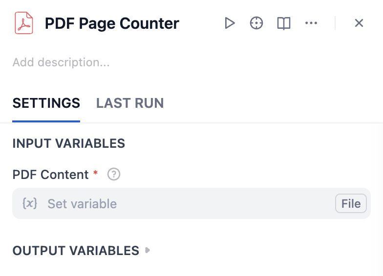

# PDF Process Plugin for Dify

A comprehensive suite of PDF processing tools for Dify, enabling various PDF operations like page extraction, counting, and splitting.

## Overview

PDF Process is a collection of powerful tools designed to perform various PDF operations within the Dify environment. Each tool is specialized for specific PDF manipulation tasks, making it easy to integrate PDF processing capabilities into your workflows.

## Features

- Single page extraction
- Multiple pages extraction with fixed page support
- PDF page counting with customizable output formats
- PDF splitting into individual pages

## Important Note
All page numbers in this plugin are 1-indexed, meaning the first page of any PDF is page 1, the second is page 2, and so on.

## Available Tools

### 1. PDF Single Page Extractor
Extracts a specific page from a PDF file and saves it as a new PDF.

Parameters:
- **PDF Content**: The input PDF file (required)
- **Page Number**: The specific page to extract (1-indexed, where page 1 is the first page, required)

### 2. PDF Multi Pages Extractor
Extracts a range of pages from a PDF file with optional fixed pages support.

Parameters:
- **PDF Content**: The input PDF file (required)
- **Start Page**: Dynamic start page for extraction (1-indexed, where page 1 is the first page, required)
- **End Page**: Dynamic end page for extraction (must be ≥ Start Page, required)
- **Fixed Start Page**: Optional starting page for fixed range (1-indexed when provided)
- **Fixed End Page**: Optional ending page for fixed range (must be ≥ Fixed Start Page when provided)

### 3. PDF Page Counter
Counts the total number of pages in a PDF file with customizable output format.

Parameters:
- **PDF Content**: The input PDF file (required)
- **Output Format**: Choose between 'number' or 'json' format (optional, defaults to 'number')

### 4. PDF Splitter
Splits a PDF file into multiple individual PDF files, creating a separate file for each page.

Parameters:
- **PDF Content**: The input PDF file (required)

## Author
Created by [Kalo Chin](https://github.com/fdb02983rhy)

## Repository
https://github.com/fdb02983rhy/dify-pdf-process-plugin